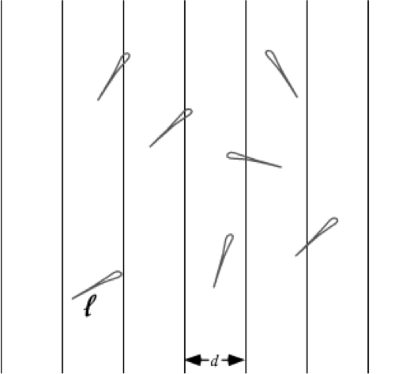

## Self-introduction (张晓炜)

* Education
    + Ph.D. in Operations Research, Stanford University, 2011
    + B.S. in Mathematics, Nankai University, 2006    
* Research 
    + stochastic simulation
    + data-based service engineering

# Overview

----

### Part 1. Fundamentals of Bayesian Inference
* What and why?

* One-parameter models
    
    + Binomial model
    + Poisson model
    + Exponential family and conjugate priors

* Normal model
    
    + Infer mean with known variance
    + Jointly infer mean and variance
    
    
    
----

### Part 2. Monte Carlo Methods

* Baisc Monte Carlo 
    * Monte Carlo integration
    * Random variable generation
    
* Markov chain Monte Carlo  
    
    + Slice sampler
    + Metropolis-Hastings algorithms    
    + Gibbs sampler


# 1. What and Why?

----

## Probability  

* I have 50% probability of getting a head when flipping a coin

* An Olympic shooter has 95% probability of hitting the target

* Weather forecast indicates 80% probability of raining tomorrow

* A cancer patient was told that he had 60% chance of surviving for at least 5 years

* There are two possible ways to interpret probability
    + Frequency
    + Belief
 
----

### Frequency

* Classical.
* Example. We expect to get a head about half the time if we flip a coin many many times
* However, repeated experiments are not possible in many situations
    
    + What is the probability that another terrorist attack of the "9-11" scale would happen in 10 years? 
    
----

### Belief

* Quantifies a particular person's subjective opinion as to how likely an event is to occur
* Not limited to repeatable events
* Different people have different probabilities regarding the same event
    
    + This is part of the reason why Bayesian statistics is controversial
    + Many people insist that probability should be _objective_

----

* The same person's subjective probability is likely to change as more information becomes available
    
    + Bayes' rule stipulates how one should update his belief with new information
    + Bayesian learning is a mathematical formulation of this process
    

----

* Here are several statements about John. After reading them, what is your belief regarding whether he is a thief?

    * He was wearing a mask standing in front of a jewelry store 
    * An alarm was set off at the same time
    * He was the owner of the store
        + He just return from a masquerade party
        + He didn't have the key with him    


## Bayes' Rule

* There are two quantities of central interest
    
    + $\theta$: a parameter that expresses the characteristics of a system
    + $Y$: a dataset that is generated by observing the system

* Bayesian inference begins with a formulation of joint beliefs about $\theta$ and $Y$

    1. _Prior_ distribution $p(\theta)$: describes our belif about the $\theta$ before seeing the dataset $Y$
    2. _Likelihood_ $p(y|\theta)$: describes our belief about $Y$
     if we knew the value of $\theta$ 
        + also called _sampling model_


----

* Once the dataset $Y$ becomes available, the last step is to update our belif about $\theta$

    3. _Posterior_ distribution $p(\theta|y)$: describes our belief about $\theta$ having observed dataset $Y$

$$p(\theta|y) = \frac{p(y|\theta) p(\theta)}{\int p(y|\tilde\theta )p(\tilde\theta) \,\mathrm{d}\tilde\theta}$$

* _Bayes’ rule does not tell us what our beliefs should
be, it tells us how they should change after seeing new information_

----

## Why Bayes?

* We are interested in the prevalence of flu in a small city
* A small random sample of 20 individuals from the city will be checked
* $\theta$: infection rate in the city
* $Y$: total number of people in the sample who are infected
 
----

### Prior

* Studies in compariable cities indicate that the infection rate ranges from 0.05 to 0.20, with an average of 0.10
* There are infinately many candicates and we use one that is _analytically tractable_ for computational convenience
    + assume $p(\theta)$ is $\mathrm{beta}(a,b)$
    + $a$ and $b$ are called _hyperparameters_
    


----

* We select $a=5$ and $b=45$ so that 
    + $E[\theta] = \frac{a}{a+b} =$ 0.1
    + $\mathrm{mode}[\theta] = \frac{a-1}{a+b-2} =$ 0.0833
    + $P(\theta\in(0.05, 0.20)) =$ 0.8815
    

    
----

### Likelihood 

* If the value of $\theta$ were known, then $Y$ can be modeled as a binomial distribution 
$$Y|\theta \sim \mathrm{binomial}(20, \theta)$$


----

### Posterior

* We will see that if $\theta \sim \mathrm{beta}(a,b)$ and $Y|\theta \sim \mathrm{binomial}(n, \theta)$, then the posterior distribution is beta too! 
$$\theta|Y \sim \mathrm{beta}(a+Y,b+n-Y)$$


----

* Suppose half of the sampled individuals are infected, i.e. $Y=10$


    + $E[\theta|Y=10] = $ 0.2143
    + $\mathrm{mode}[\theta|Y=10] = $ 0.2059    
    + 95% confidence interval is (0.122, 0.3107), i.e.
    $$P(\theta \in(0.122, 0.3107) | Y=10) =  95\%$$

----

### Comparison to Frequentist Approach
* No prior information is needed
* Point estimate: $\hat\theta = \frac{Y}{n}$
* 95% confidence interval is $\hat\theta \pm 1.96\sqrt{\frac{\hat\theta(1-\hat\theta)}{n}}$
    + With $Y=10$, it is $(0.2809, 0.7191)$, much _wider_ than the Bayesian counterparty
    + _Prior information helps reduce uncertainty!_ 


# 2. One-parameter Models

## Binomial Model

* $Y$ has binomial distribution with parameter $n$ and $\theta$
    + $n$ is known, $\theta$ is unknown
    + $Y$ is number of "successes" in $n$ independent trials
        + sum of $n$ i.i.d. Bernoulli random variables
    + Each trial has $\theta$ probability of success

* Likelihood: $Y|\theta \sim \mathrm{binomial}(n, \theta)$
$$p(Y|\theta) = {n\choose Y} \theta^Y(1-\theta)^{n-Y}$$

----

### Uniform Prior

* Each value has equal possibility: $\theta \sim \mathrm{uniform}[0,1]$
$$p(\theta) = 1$$
    + A _noninformative_ prior

* Bayes' rule asserts:
$$p(\theta|Y) = \frac{p(Y|\theta)p(\theta)}{p(Y)} = \frac{p(Y|\theta)}{p(Y)}\propto p(Y|\theta)$$ 
* $\propto$ means "is proportional to"
    + $p(\theta|Y)$ is proportional to $p(Y|\theta)$ _as a function of $\theta$_
    + because $p(Y)$ does not depend on $\theta$

----

* Further, we can see that 
$$p(\theta|Y)\propto \theta^Y(1-\theta)^{n-Y}$$
* So if we assume  $p(\theta|Y) = C \theta^Y(1-\theta)^{n-Y}$ for some constant $C>0$, then 
$$C^{-1} = \int_0^1 \theta^Y(1-\theta)^{n-Y}\,\mathrm{d}\theta = B(Y+1, n-Y+1),$$ 
where $B$ is the beta function, because $\int_0^1 p(\theta|Y)\,\mathrm{d}\theta = 1$
* So 
$$p(\theta|Y) = \frac{\theta^Y(1-\theta)^{n-Y}}{B(Y+1, n-Y+1)},$$
i.e. $\theta|Y \sim \mathrm{beta}(Y+1, n-Y+1)$

----

### Beta Prior

* $\theta \sim \mathrm{beta}(a,b)$
$$p(\theta) = \frac{\theta^{a-1}(1-\theta)^{b-1}}{B(a, b)}$$
* Uniform distribution is a special case of beta distribution
    + uniform[0,1] = beta(1,1)
* Applying Bayes' rule
$$
\begin{align*}
p(\theta|Y) \propto & p(Y|\theta)p(\theta) \\ 
= &  {n\choose Y}\theta^Y(1-\theta)^{n-Y}\times \frac{\theta^{a-1}(1-\theta)^{b-1}}{B(a, b)}
\end{align*}
$$
so $p(\theta|Y) = C \theta^{a+Y-1}(1-\theta)^{b+n-Y-1}$ for some positive constant $C$, where


----

$$
\begin{align*}
C^{-1} = & \int_0^1 \theta^{a+Y-1}(1-\theta)^{b+n-Y-1}\,\mathrm{d}\theta \\ 
= & B(a+Y, b+n-Y)
\end{align*}
$$


* So the posterior distribution is $\mathrm{beta}(a+Y, b+n-Y)$, i.e.
$$p(\theta|Y) = \frac{\theta^{a+Y-1}(1-\theta)^{b+n-Y-1}}{B(a+Y, b+n-Y)}$$

----

### Conjugacy

* A class $\mathcal P$ of prior distributions for $\theta$ is called _conjugate_ for a sampling model $p(y|\theta)$ if
$$p(\theta)\in\mathcal P \Rightarrow p(\theta|y)\in\mathcal P$$
    + Conjugate priors make posterior calculations easy
    + but might not actually represent our prior information

* Beta prior is conjugate for the binomial sampling model

----

### Combining Information
* $\theta|Y \sim \mathrm{beta}(a + Y, b + n - Y)$ 
$$
\begin{align*}
E[\theta|Y=y] = & \frac{a+y}{a + b + n} \\
= &\frac{n}{a+b+n}\cdot \hat\theta + \frac{a + b}{a+b+n}\cdot \theta_0
\end{align*}
$$
* $\hat\theta=\frac{y}{n}$ is the frequentist estimate of $\theta$
* $\theta_0=\frac{a}{a+b}$ is the prior expectation of $\theta$

1. The posterior expectation is the _weighted average_ of $\hat\theta$ and $\theta_0$
2. The weight of $\theta_0$ vanishes as $n\to\infty$
    + The impact of prior information gradually fades away when the dataset is sufficiently large


----


### Prediction

* Let $\tilde Y$ be an additional outcome from the same population 
* _Predictive distribution_: $p(\tilde Y|Y)$

$$
\begin{align*}
& P(\tilde Y = k| Y) \\= & \int P(\tilde Y=k|\theta, Y)p(\theta|Y)\,\mathrm{d}\theta \\
= & \int_0^1  {n\choose k} \theta^k (1-\theta)^{n-k}\cdot \frac{\theta^{a+Y-1}(1-\theta)^{b+n-Y-1}}{B(a+Y, b+n-Y)} \,\mathrm{d}\theta \\
=& {n\choose k}\frac{B(a+Y+k, b+2n-Y-k)}{B(a+Y, b+n-Y)}
\end{align*}
$$

----


```r
pred_dist <- function(k, Y, a, b, n) {
    choose(n, k) * beta(a + Y + k, b + 2 * n - Y - k)/beta(a + Y, b + n - Y)
}
a <- 5
b <- 45
n <- 20
Y <- 10
pred_dist(seq(0, n), Y, a, b, n)
```

```
##  [1] 1.485e-02 6.022e-02 1.254e-01 1.776e-01 1.914e-01 1.662e-01 1.205e-01
##  [8] 7.440e-02 3.970e-02 1.845e-02 7.492e-03 2.661e-03 8.235e-04 2.207e-04
## [15] 5.065e-05 9.792e-06 1.556e-06 1.957e-07 1.831e-08 1.136e-09 3.511e-11
```

----


----


* The predictive distribution does not depend on any unknown quantities
    + It is calculated by "integrating out" the uncertainty about $\theta$
* $\tilde Y$ is not independent of $Y$
    + $Y$ gives information about $\theta$, which in turn gives informationa bout $\tilde Y$


----

### Confidence Regions

* Regions of the parameter space that cotains the true value of the parameter with high probability
    + After observing the data $Y = y$, construct an interval $[l(y), u(y)]$ such that $P(l(y)<\theta<u(y))$ is large 
    

----
    
* _Bayesian coverage_: an interval $[l(y),u(y)]$ has $100(1-\alpha)\%$ Bayesian coverage for $\theta$ if, _after_ the data are observed,
$$P(l(y)<\theta<u(y)|Y=y) = 1-\alpha$$
* _Frequentist coverage_: a random interval $[l(Y),u(Y)]$ has $100(1-\alpha)\%$ frequentist coverage for $\theta$ if, _before_ the data are observed,
$$P(l(Y)<\theta<u(Y)|\theta) = 1-\alpha$$
* In a sense, the frequentist and Bayesian notions of coverage describe pre- and post-experimental coverage, respectively.

----

### Quantile-based Intervals

* Remove both tails of $\alpha/2$ probabilitiy
* Use $[\theta_{\alpha/2}, \theta_{1-\alpha/2}]$, where $\theta_{\alpha/2}$ and $\theta_{1-\alpha/2}$ are posterior quantiles 
$$P(\theta < \theta_{\alpha/2}|Y=y) = P(\theta > \theta_{1-\alpha/2}|Y=y) =\alpha/2$$


* Easy to implement

```r
a <- 5; b <- 45; n <- 20; Y <- 10; 
qbeta(c(0.025, 0.975), a + Y, b + n - Y)
```

```
## [1] 0.1271 0.3169
```


----

### Highest Posterior Density Region

* If the posterior distribution is not _symmetric_, a quantile-based interval excludes some points that have higher density than some points inside the interval

* _HPD region_: a subset of the parameter space $s(y)$ such that
    1. $P(\theta\in s(y)|Y=y) = 1-\alpha$
    2. $p(\theta_1|Y=y) > p(\theta_2|Y=y)$ for $\theta_1\in s(y)$ and $\theta_2\notin s(y)$

* May not be an interval if the posterial density is _multimodal_, i.e. has multiple peaks 


----

* Harder to implement: usually apply simulation to approximate

```r
a <- 5; b <- 45; n <- 20; Y <- 10;
require(hdrcde)
as.vector(hdr(rbeta(1e5, a + Y, b + n - Y), prob=95)$hdr)
```

```
## [1] 0.1207 0.3089
```


## Poisson Model
* Usually models the number of events occurring in a fixed time period
* Likelihood: $Y|\theta \sim \mathrm{Poisson}(\theta)$ 
$$p(Y|\theta) = \frac{\theta^Ye^{-\theta}}{Y!}$$
    + $E[Y|\theta] = \mathrm{var}(Y|\theta) = \theta$
    


----

### Gamma Prior

* $\theta \sim \mathrm{Gamma}(a, b)$
    + $a$ is the shape parameter and $b$ is the rate parameter
$$p(\theta) = \frac{b^a}{\Gamma(a)}\theta^{a-1}e^{-b\theta}$$
    + $E[\theta] = \frac{a}{b}$


----

### Posterior

* By Bayes' rule, 
$$p(\theta|Y) \propto p(Y|\theta)p(\theta)= \frac{\theta^Ye^{-\theta}}{Y!}\times \frac{b^a}{\Gamma(a)}\theta^{a-1}e^{-b\theta} $$
* So $p(\theta|Y) = C\theta^{a+Y-1}e^{-(b+1)\theta}$, where 
$$C^{-1} = \int_0^\infty \theta^{a+Y-1}e^{-(b+1)\theta}\,\mathrm{d}\theta = \frac{\Gamma(a+Y)}{(b+1)^{a+Y}}$$
* So 
$$p(\theta|Y) = \frac{(b+1)^{a+Y}}{\Gamma(a+Y)}\theta^{a+Y-1}e^{-(b+1)\theta},$$
i.e. $\theta|Y\sim\mathrm{Gamma}(a+Y, b+1)$
* Gamma prior is conjugate for the Poisson sampling model

----

### Combining Information
* Suppose $Y_1,\ldots,Y_n$ are i.i.d. Poisson
* Then $\theta|Y_1,\ldots,Y_n \sim \mathrm{Gamma}(a+\sum_{i=1}^nY_i, b+n)$ 

$$
\begin{align*}
E[\theta|Y_1,\ldots,Y_n] =& \frac{a+\sum_{i=1}^nY_i}{b+n} \\
=& \frac{n}{b+n}\cdot \hat\theta + \frac{b}{b+n}\cdot \theta_0
\end{align*}
$$

* $\hat\theta=\frac{\sum_{i=1}^nY_i}{n}$ is the frequentist estimate of $\theta$
* $\theta_0=\frac{a}{b}$ is the prior expectation of $\theta$

1. The posterior expectation is the _weighted average_ of $\hat\theta$ and $\theta_0$
2. The weight of $\theta_0$ vanishes as $n\to\infty$
    + The impact of prior information gradually fades away when the dataset is sufficiently large

----

### Prediction
* The predictive distribution of $\tilde Y$, an additional outcome from the same population, given the observation $Y$
$$
\begin{align*}
 &\textstyle P(\tilde Y=k|Y)\\ =& \int_0^\infty P(\tilde Y=k|\theta )p(\theta|Y)\,\mathrm{d}\theta \\
=& \int_0^\infty \frac{\theta^k e^{-\theta}}{k!}\cdot \frac{(b+1)^{a+Y}\theta^{a+Y-1}e^{-(b+1)\theta}}{\Gamma(a+Y)}\,\mathrm{d}\theta \\
=& \frac{\Gamma(a+Y+k)}{\Gamma(k+1)\Gamma(a+Y)}\left(\frac{b+1}{b+2}\right)^{a+Y}\left(\frac{1}{b+2}\right)^k
\end{align*}$$


----


* So $\tilde Y|Y$ has a negative binomial distribution with "number of failures" $a+Y$ and "success probability" $\frac{1}{b+2}$


```r
a <- 2; b <- 1; Y <- 5; 
dnbinom(seq(0, 10), a + Y, 1 / (b + 2))
```

```
##  [1] 0.0004572 0.0021338 0.0056902 0.0113804 0.0189673 0.0278187 0.0370916
##  [8] 0.0459229 0.0535768 0.0595297 0.0634984
```


----


## Exponential Families and Conjugate Priors

* Both binomial and Poisson models belong to one-parameter _exponential family models_, whose densities are of the form
$$p(y|\theta)=a(y)e^{\phi(\theta)t(y)+b(\theta)}$$ 
* Binomial model
$$\textstyle \phi(\theta)=\log\left(\frac{\theta}{1-\theta}\right), 
t(y)=y, 
b(\theta) = n\log(1-\theta),
a(y) = {n\choose y}$$
* Poisson model
$$\phi(\theta) = \log\theta, t(y) = y, b(\theta) = -\log(\theta),  a(y) = 1$$
* Exponential model
$$\phi(\theta) = -\theta, t(y) = y, b(\theta) = \log(\theta),  a(y) = 1$$
* Normal model (with $\sigma^2$ known)
$$\textstyle \phi(\theta) = \frac{\theta}{\sigma^2}, t(y) = y, b(\theta) = -\frac{\theta^2}{2\sigma^2},  a(y) = \exp\left(\textstyle-\frac{y^2}{2\sigma^2}\right)$$

----

* Choose a prior of the form $p(\theta)=k(\alpha,\beta)e^{\alpha\phi(\theta)+\beta b(\theta)}$
* Then the posterior is 
$$p(\theta|Y)\propto e^{(\alpha+t(Y))\phi(\theta)+(\beta+1)b(\theta)}$$
* So the prior is conjugate for the exponential family model
* In general, the posterior conditional on the i.i.d. data $Y_1,\ldots,Y_n$ is 
$$p(\theta|Y_1,\ldots,Y_n)\propto e^{(\alpha+\sum_{i=1}^nt(Y_i))\phi(\theta)+(\beta+n)b(\theta)}$$


# 3. Normal Model


## Normal Model

* Normal distribution is probably the most useful probability model in statistics
    + supported by central limit theorem
    + two parameters, mean $\mu$ and variance $\sigma^2$, are often of primary interest
    
$$p(y|\mu, \sigma^2) =\frac{1}{\sqrt{2\pi\sigma^2}}\textstyle\exp\left(-\frac{(y-\mu)^2}{2\sigma^2}\right),\quad -\infty < y < \infty$$


----

* the distribution is symmetric about $\theta$, and the mode, median and mean are all equal to $\theta$

* about 95% of the population lies within two standard deviations of the mean (more precisely, 1.96 standard deviations)


----

## Inference on Mean with Known Variance

* Choose a normal prior on the mean, i.e. $\mu\sim \mathrm{normal}(\mu_0, \tau_0)$
$$
\begin{align*}
p(\mu|Y, \sigma^2) & = \frac{p(\mu|\sigma^2)p(Y|\mu,\sigma^2)}{p(Y|\sigma^2)} 
\propto p(\mu|\sigma^2) p(Y|\mu,\sigma^2) \\
&\propto \textstyle \exp\left(-\frac{(\mu-\mu_0)^2}{2\tau_0}\right)\exp\left(-\frac{(Y-\mu)^2}{2\sigma^2}\right) 
\end{align*}$$
* The exponent is quadratic in $\mu$ so $p(\mu|Y,\sigma^2)$ is normal with mean 
$$ \frac{\frac{1}{\tau_0^2}\mu_0+\frac{1}{\sigma^2}Y}{\frac{1}{\tau_0^2}+\frac{1}{\sigma^2}}$$
and variance
$$\frac{1}{\frac{1}{\tau_0^2}+\frac{1}{\sigma^2}}$$

----

* In general, given i.i.d. normal data $Y_1,\ldots,Y_n$, if we select a normal prior on $\mu$, then $p(\mu|Y_1,\ldots,Y_n,\sigma^2)$ is normal with mean $\mu_n$ and variance $\tau_n^2$, where
$$\mu_n = \frac{\frac{1}{\tau_0^2}\mu_0+\frac{n}{\sigma^2}\bar{Y}}{\frac{1}{\tau_0^2}+\frac{n}{\sigma^2}}\quad\mbox{and}\quad \tau_n^2=\frac{1}{\frac{1}{\tau_0^2}+\frac{n}{\sigma^2}}$$

* Inverse variance is often called _precision_ and it quantifies the information
$$\frac{1}{\tau_n^2}=\frac{1}{\tau_0^2}+\frac{n}{\sigma^2}$$
    + Posterior info = prior info + data info
    + Precision is increasing in $n$
* Posterior mean is a weighted average of the prior mean and the sample mean 
$$\mu_n = \frac{\tau_0^{-2}}{\tau_0^{-2}+n\sigma^{-2}}\mu_0 + \frac{n\sigma^{-2}}{\tau_0^{-2}+n\sigma^{-2}}\bar{Y}$$


----

### Example 

* The revenue of a Taobao shop in the past 9 months is as follows (unit: million RMB) and we hope to make inference on the mean monthly revenue. 


```
## [1] 1.82 2.30 1.64 1.52 1.72 1.36 1.74 2.08 1.97
```

* We know the average monthly revenue in million RMB in 2012 is about 2 and its s.d. is about 0.6
    + Choose prior on $\mu$ as $\mathrm{normal}(2, 0.6^2)$ 
* We use the sample variance as $\sigma^2$

----


```r
revenue <- c(1.82, 2.3, 1.64, 1.52, 1.72, 1.36, 1.74, 2.08, 1.97)
n <- length(revenue)
Y_bar <- mean(revenue)
s2 <- var(revenue)
mu_0 <- 2
tau_0 <- 0.6
a <- 1/tau_0^2 + n/s2
b <- mu_0/tau_0^2 + n/s2 * Y_bar
tau_n <- sqrt(1/a)
mu_n <- b/a
```
* So the posterior distribution of the average monthly revenue is normal with mean 1.7996 and s.d. 0.0949
    + Its prior is normal with mean 2 and s.d. 0.6
    + Sample mean is 1.7944 and sample s.d. is 0.2883
* Remark: posterior s.d. is smaller than both prior s.d. and sample s.d.

----


----

## Joint Inference on Mean and Variance

* In the previous example, we assumed $\sigma^2$ is known and use the sample variance for its value
    + Due to the small sample size, the sample variance has a fairly large uncertainty in itself which we have ignored    
* Hence, we need to infer $\mu$ and $\sigma^2$ at the same time and find a joint prior on $(\mu, \sigma^2)$

$$p(\mu,\sigma^2|Y_1,\ldots,Y_n) \propto p(Y_1,\ldots,Y_n| \mu,\sigma^2)p(\mu,\sigma^2)$$

-----

* In choosing the joint prior $p(\mu,\sigma^2)$, note that
$$p(\mu,\sigma^2) = p(\mu|\sigma^2)p(\sigma^2)$$
* We have seen that if $\sigma^2$ were known, then a conjugate prior on $\mu$ is normal so we set $p(\mu|\sigma^2)$ as normal

* We need a distribution that has support on $(0, \infty)$ for $\sigma^2$ and it turns out Gamma distribution is a crutial element 


----

* The joint prior is chosen as follows 
$$
\begin{align*}
\theta|\sigma^2 & \sim \mathrm{normal}\textstyle\left(\mu_0, \frac{\sigma^2}{\kappa_0}\right)\\
\sigma^{-2} & \sim \mathrm{gamma}\textstyle\left(\frac{\nu_0}{2}, \frac{\nu_0\sigma_0}{2}\right) 
\end{align*}
$$

* $\mu_0$ and $\kappa_0$ can be interpreted as  the mean and sample size from a set of prior observations


----


* Then using Bayes' rule, we can show that (details are left for exercise)
$$\{\mu|Y_1,\ldots,Y_n, \sigma^2\} \sim \mathrm{normal}(\mu_n, \sigma^2/\kappa_n),$$ where
$$\kappa_n = \kappa_0+n\quad\mbox{and}\quad \mu_n=\frac{\kappa_0\mu_0+n\bar{Y}}{\kappa_n},$$
and 
$$\{\sigma^{-2}|Y_1,\ldots,Y_n\} \sim \mathrm{gamma}(\nu_n/2,\nu_n\sigma_n^2/2), $$
where 
$$
\begin{align*}
\nu_n &=\nu_0 + n \\
\sigma_n^2 &= \frac{1}{\nu_n}[\nu_0\sigma_0^2 + (n-1)s^2 + \frac{\kappa_0n}{\kappa_n}(\bar{Y}-\mu_0)^2]
\end{align*}
$$
and 
$s^2$ is the sample variance of $Y_1,\ldots,Y_n$

* $\nu_0\sigma_0^2$ and $\nu_n\sigma_n^2$ can be interpreted as prior and posterior "sum of squared observations from the sample mean"

----

### Back to Previous Example

* Assume both $\mu$ and $\sigma^2$ are unknown
* We know the average monthly revenue in million RMB in 2012 is about 2 and its s.d. is about 0.6
    + choose prior parameters $\mu_0=2$, $\sigma_0=0.6$, $\kappa_0=12$ and $\nu_0 = 12$    


```r
mu_0 <- 2
sigma_0 <- 0.6
kappa_0 <- 12
nu_0 <- 12
n <- length(revenue)
Y_bar <- mean(revenue)
s2 <- var(revenue)
kappa_n <- kappa_0 + n
mu_n <- (kappa_0 * mu_0 + n * Y_bar)/kappa_n
nu_n <- nu_0 + n
sigma_n <- sqrt((nu_0 * sigma_0^2 + (n - 1) * s2 + kappa_0 * n/kappa_n * (Y_bar - 
    mu_0)^2)/nu_n)
```


----

* The posterior parameters are $\mu_n = 1.9119$, $\kappa_n = 21$, $\nu_n = 21$, and $\sigma_n^2 = 0.2477$. 

* The posterior joint distribution of $(\mu,\sigma^2)$ is determined by 
$$
\begin{align*}
\{\mu|Y_1,\ldots,Y_n, \sigma^2\} &\sim \mathrm{normal}(1.9119, \sigma^2/21),\\
\{\sigma^{-2}|Y_1,\ldots,Y_n\} & \sim \mathrm{gamma}(10.5,2.6012), 
\end{align*}
$$


----

* It can be shown that $\frac{\mu-\mu_n}{\sigma_n/\sqrt{\kappa_n}}$ has a $t$-distribution with $\nu_n$ degrees of freedom
    + This gives the _marginal_ posterior distribution of $\mu$, i.e. $p(\mu|Y_1,\ldots,Y_n)$

* As expected, the uncertainty about the posterior distribution of $\mu$ is larger when assuming $\sigma^2$ is unknown


-----

### Usage of Conjugate Priors is Limited

+ Only exist for simple models/distributions
+ Only for _computatational_ reasons
    + Keep distribution family fixed and update hyperparameters only

+ Restricts our modeling of prior information    
    + Implies a _subjective_ manipulation of the prior information 
    + E.g., why is the prior of a binomial distribution necessarily beta distribution? 

----

### How do We Deal with Non-conjugate Priors? 

+ Monte Carlo Simulation! 

# 4. Baisc Monte Carlo


## Introduction

+ Monte Carlo methods are a broad class of computational algorithms that rely on repeated random sampling to obtain numerical results

+ One runs simulations many times to obtain the information of an unknown probabilistic entity

+ Mordern version of MC was invented by Stanislaw Ulam in late 1940s, while he was working on nuclear weapons projects at the Los Alamos National Laboratory


-----

+ "Monte Carlo" was named after the Monte Carlo Casino in Monte Carlo, Monaco

<center>

</center>

-----


### Buffon's Needle

+ The French naturalist Buffon in 1733 stated a problem: find the probability that a needle of length $l$ will land on a line, given a floor with equally spaced parallel lines a distance $d$ apart
    + Answer: $p = \frac{2l}{\pi d}$ when $d\geq l$


<center>

</center>


-----

+  We then can use this experiment to estimate the probability $p$ and then the value of $\pi$ 

<center>

<figcaption>Result of 500 random tosses of a needle with $d$ = 3 and $l$ = 1. There are 107 needles cross a line, giving $\pi\approx 3.116$. </figcaption>
</center>

-----

### Calculating $\pi$

+ MC is most commonly used to evaluate integrals (including probabilities)


-----

## Monte Carlo Integration

+ Let $X$ be a random variable with density $f(x)$  and we are interested in computing 
$$\mathbb{E}[h(X)] = \int  h(x)f(x)\, dx$$

+ MC generates a sample $X_1,\ldots,X_n$ from the density $f$ and approximates the integral with 
$$\bar{h}_n = \frac{1}{n}\sum_{j=1}^n h(X_j)$$


+ **Convergence** (Strong Law of Large Numbers)
$$\lim_{n\to\infty}\frac{1}{n}\sum_{j=1}^n h(X_j) = \mathbb{E}[h(X)]$$


-----

### Example

+ Compute $\int_0^1 [x^2+4x\sin(x)]\,dx$ 
    + Exact value is $\frac{1}{3} + 4[\sin(1)-cos(1)] = 1.538$
+ Write the integral as $\mathbb{E} [X^2+4X\sin(X)]$ where $X\sim\mathrm{Uniform}(0,1)$

```r
N <- 10^4
X <- runif(N)
mean(X^2 + 4 * X * sin(X))
```

```
## [1] 1.521
```

-----

### Errors in MC

+ Clearly, the estimation error decreases as the number of replications $n$  increases 
+ But can we quantify the error for a given $n$? 
+ Back to the previous exmaple, plot the error against $n$


-----

+ Error is of order $n^{-1/2}$ 

+ Central Limit Theorem 
$$\frac{\bar{h}_n - \mathbb{E}[h(X)]}{\sqrt{\mathrm{Var(h(X))}}}\Rightarrow \mathcal N(0, 1)$$
    
+ So error is roughly $\sqrt{\frac{\mathrm{Var}(h(X))}{n}}\mathcal\cdot N(0, 1)$ when $n$ is large
+ However, $\mathrm{Var(h(X))}$ is usually unknown and instead we use the sample variance $s_n^2 = \frac{1}{n^2}\sum_{j=1}^n[h(X_j)-\bar{h}_n]^2$ to approximate it


## Random Variable Generation


+ Use computer to repeatedly produce samples from the target distribution so that the empirical distribution can approximate the true distribution


$$ 0.2\mathcal N(-5, 4) + 0.5\mathcal N(0, 1) + 0.3\mathcal N(3, 0.25) $$


----

+ Statistical software packages implement only "standard" probability distributions

+ We will be concerned with generating random variables from an arbitrary density
    + For example, posterior densities are usually of the form 
    $$p(\theta|Y) \propto p(Y|\theta)p(\theta)$$


## Pseudo-random Numbers

+ Monte Carlo simulation is fundamentally based on the production of uniform random variables between 0 and 1

+ Computed-generated uniform random variables are product of a _deterministic_ algorithm and not truely random
    + Given the algorithm and the _seed_, all the subsequent numbers are known with certainty
    + However, without these knowledge, they do _appear_ to be random and can pass various statistical tests 
    + So they're called _pseudo-random_ numbers

----

### Linear Congruential Generator

+ Simple; building block of many advanced methods 
+ First produces a sequence of integers 
$$X_{i+1} = (aX_i + c) \mod m,\quad i=0,1,2,\ldots$$
    + Initial value $X_0$ is called seed
+ Then transform them to numbers between 0 and 1 by 
$$R_i = \frac{X_i}{m}$$

+ Shortcoming: period is not long enough for modern usage

----

+ In R, `runif` generates pseudo-random numbers and `set.seed` sets random seed 
    + Random seed should be manually set only for the purpose of reproducibility of the results


```r
runif(5)
```

```
## [1] 0.3173 0.1400 0.5211 0.7444 0.5071
```

```r
runif(5)
```

```
## [1] 0.8583 0.1479 0.7216 0.6846 0.2722
```

```r
set.seed(123)
runif(5)
```

```
## [1] 0.2876 0.7883 0.4090 0.8830 0.9405
```

```r
set.seed(123)
runif(5)
```

```
## [1] 0.2876 0.7883 0.4090 0.8830 0.9405
```

## Inverse Transform Method

+ If $X$ has density $f$ and cumulative distribution function $F$
$$F(x) = \int^x_{-\infty} f(t)\,dt ,$$
then $F^{-1}(U)$ has the same distribution as $X$, where $U$ is the uniform random variable between 0 and 1 and $F^{-1}$ is the inverse function of $F$
$$P(F^{-1}(U)\leq x) = P(U \leq F(x)) = F(x)$$

----

### Examples

+ If $X$ has exponential distribution with mean $\frac{1}{3}$, then $F(x) = 1 - e^{-3x}$
    + $F^{-1}(U) = -\frac{1}{3}\log(1-U)$ 
    

```r
N <- 10^4; U <- runif(N);
X <- -log(1 - U) / 3;
mean(X)  ## true mean is 1/3
```

```
## [1] 0.3286
```

```r
sd(X)  ## true sd is 1/3
```

```
## [1] 0.3286
```

----


----


+ Cauchy distribution 
    + Density: $f(x)=\frac{1}{\pi (1+x^2)}$
    + CDF: $F(x) = \frac{1}{2} + \frac{1}{\pi}\arctan(x)$
    + $F^{-1}(u) = \tan\left(\pi\left(u-\frac{1}{2}\right)\right)$
+ Pareto distribution
    + Density: $f(x) = \frac{\alpha}{x^{\alpha+1}}$, $x\geq 1$
    + CDF: $F(x) = 1 - \frac{1}{x^\alpha}$
    + $F^{-1}(u) = \frac{1}{(1-u)^{1/\alpha}}$

----

### Remarks

+ Inverse transform method allows us to transform the uniform distribution to _any_ other distribution in theory
+ However, very often the CDF or its inverse function is difficult or even impossible to compute, in which case we resort other approaches
    + E.g. normal distribution

```r
N <- 10^6; U <- runif(N); 
system.time(qnorm(U, mean=0, sd=1))
```

```
##    user  system elapsed 
##   0.035   0.002   0.037
```

```r
system.time(rnorm(N, mean=0, sd=1))
```

```
##    user  system elapsed 
##   0.069   0.000   0.069
```

## Acceptance-rejection Method

+ **Idea**: if the target distribution is difficult or impossible to directly simulate, then we simulate a simpler distribution and accept only part of the samples based on certain criteria
    
    
----

Given a target density $f$, find a density $g$ and a constant $M>0$ such that 
$$f(x) \leq M g(x)$$
for all $x$ on the support of $f$

1. Generate $X$ from $g$ and $U$ from Uniform[0,1]
2. If $U\leq \frac{f(X)}{Mg(X)}$, accept $X$ 
3. Otherwise, reject $X$ and return to step 1

----

### Illustration

+ Generate a random point $(X, Mg(X))$ in the region below the function $Mg(x)$ 
    + $X$ follows density $g$
+ Accept such a point if and only if it is below the function $f(x)$


-----

### Why? 

+ The accepted values are _conditioned_ values
+ Unconditioned $X$ has density $g$, but the accepted $X$ has density $f$

$$
\begin{align*}
P(X\leq x | \mathrm{accept}) = & \frac{P(X\leq x, U\leq \frac{f(X)}{Mg(X)})}{P(U\leq \frac{f(X)}{Mg(X)})} \\ 
= & \frac{\int g(t) P(X \leq x, U\leq \frac{f(X)}{Mg(X)}|X=t)\, dt}{\int  g(t) P(U\leq \frac{f(X)}{Mg(X)}|X=t)\, dt} \\
= & \frac{\int_{-\infty}^x g(t) \frac{f(t)}{Mg(t)}\,dt}{\int_{-\infty}^\infty g(t) \frac{f(t)}{Mg(t)}\,dt} = \int_{-\infty}^x f(t)\,dt
\end{align*}
$$

----

### Remarks

+ $g$ is often called the *instrumental* density
+ An exact upper bound $M$ is not necessary
+ The acceptance rate is $M^{-1}$, so the smaller $M$ the better (more efficient)
    + The efficiency of the method is determined by how closely $g$ can imitate $f$, especially in the tails
+ It is necessary for $g$ to have a "heavier" tail than $f$
    + It is impossible to use the A-R method to simulate a Cauchy distribution using a normal distribution, but the reverse works well

-----

### Example: Normal from Cauchy
+ $f$ is a normal density:
$f(x) = \frac{1}{\sqrt{2\pi}}e^{-x^2/2}$
+ $g$ is a Cauchy density:
$g(x) = \frac{1}{\pi(1+x^2)}$

$$\frac{f(x)}{g(x)}=\sqrt{\frac{\pi}{2}}(1+x^2)e^{-x^2/2} $$ is maximized at $x=\pm 1$ and the maximum is $M=\sqrt{\frac{2\pi}{e}}$

+ So the acceptance rate is $\sqrt{\frac{e}{2\pi}}\approx 0.6577$

----


```r
N <- 10^4
M <- sqrt(2 * pi/exp(1))
samples <- rcauchy(N)
U <- runif(N)
A_or_R <- U <= dnorm(samples)/(M * dcauchy(samples))
accepted_samples <- samples[A_or_R]
mean(accepted_samples)
```

```
## [1] 0.006658
```

```r
sd(accepted_samples)
```

```
## [1] 1.014
```

```r
length(accepted_samples)/N  ## true P(accept) = 0.6577
```

```
## [1] 0.6556
```

----


----

### Example: Normal from Doubly Exponential

+ Cauchy tail $x^{-2}$ is much heavier than the normal tail $e^{-x^2}$

+ Try the doubly exponential distribution $g(x) = \frac{1}{2} e^{-|x|}$
    + lighter than Cauchy but is still heavier than normal

$$\frac{f(x)}{g(x)} = \sqrt{\frac{2}{\pi}}e^{|x|-x^2/2}$$
is maximized at $x=\pm 1$ and the maximum is $M=\sqrt{\frac{2 e}{\pi}}$

+ The acceptance rate is $\sqrt{\frac{\pi }{2e}} \approx 0.7602$
    + higher than using Cauchy as the instrumental density

----


```r
N <- 10^4
M <- sqrt(2 * exp(1)/pi)
samples <- rexp(N) * sample(c(1, -1), N, replace = TRUE)
U <- runif(N)
A_or_R <- U <= dnorm(samples)/(M * 0.5 * dexp(abs(samples)))
accepted_samples <- samples[A_or_R]
mean(accepted_samples)
```

```
## [1] -0.008401
```

```r
sd(accepted_samples)
```

```
## [1] 0.9811
```

```r
length(accepted_samples)/N  ## true P(accept) = 0.7602
```

```
## [1] 0.7648
```

----


----

### Example: Beta from Uniform

+ $f$ is a beta density: $f(x) = \frac{x^{a-1}(1-x)^{b-1}}{B(a,b)}$, $0\leq x\leq 1$, with $a, b>1$
+ $g$ is uniform density: $g(x) = 1$, $0\leq x\leq 1$

$$\frac{f(x)}{g(x)} = \frac{x^{a-1}(1-x)^{b-1}}{B(a,b)} $$ is maximized at $x=\frac{a-1}{a+b-2}$ and its maximum is 

$$M = \frac{(a-1)^{a-1}(b-1)^{b-1}}{(a+b-2)^{a+b-2}B(a,b)}$$

+ Assume $a = 2.5$ and $b=4.2$.  The acceptance rate is 0.4733

----


```r
N <- 10^4
a <- 2.5
b <- 4.2
M <- (a - 1)^(a - 1) * (b - 1)^(b - 1)/(a + b - 2)^(a + b - 2)/beta(a, b)
samples <- runif(N)
U <- runif(N)
A_or_R <- U <= dbeta(samples, a, b)/M
accepted_samples <- samples[A_or_R]
mean(accepted_samples)  ## true mean is a/(a+b) = 0.3731
```

```
## [1] 0.3745
```

```r
var(accepted_samples)  ## true variance is ab/(a+b)^2/(a+b+1) = 0.0304 
```

```
## [1] 0.03065
```

```r
length(accepted_samples)/N  ## true P(accept) = 0.4733
```

```
## [1] 0.4675
```

----


----

### Remarks

+ If the target density $f$ has a *bounded* support, then we can always choose the uniform distribution on the support of $f$ as the instrumental density 
+ Then, $M=\max_x f(x)$


# 5. Markov Chain Monte Carlo

## Introduction

+ The posterior distribution in Bayesian statistics is of the form $p(\theta|y) \propto p(\theta)p(y|\theta)$
    + So it is often known up to a normalizing constant, i.e. $p(\theta|y) = C p(\theta)p(y|\theta)$ for some $C>0$ but $C$ is difficult or impossible to compute

+ The basic idea of MCMC is to construct a Markov chain whose *stationary* distribution is the distribution of interest
    + The normalizing constant is not necessary in the process
    
-----

+ The literature on MCMC is enormous 
    + *Monte Carlo Statistical Methods*, C. P. Robert and G. Casella, 2nd ed., 2004

+ We only introduce three simple MCMC algorithms, but their usage dominates in a great number of applications
    + Slice sampler
    + Metropolis-Hastings algorithm
    + Gibbs sampler

----


## Slice Sampler

+ **Fundamental Theorem of Simulation**: Simulating $X\sim f(x)$ is equivalent to simulating 
$$(X, U) \sim \mathrm{Uniform}\{(x,u):0\leq u\leq f(x)\}$$


----

### Idea
+ Construct a *random walk* in the region $A=\{(x,u):0\leq u\leq f(x)\}$, whose stationary distribution is the uniform distribution on $A$
    + Do random jumps alternately in vertical and horizontal directions
    + Vertical: uniform on $\{u: 0\leq u\leq f(x)\}$
    + Horizontal: uniform on $\{x: f(x)\geq u\}$, i.e. "slice"

-----

### Slice Sampler Algorithm

For $t=1,\ldots,T$, when at $(x^{(t)}, u^{(t)})$ simulate

1. $u^{(t+1)} \sim \mathrm{Uniform}(0, f(x^{(t)}))$
2. $x^{(t+1)} \sim \mathrm{Uniform}(A^{(t+1)})$, where $A^{(t+1)} = \{x: f(x)\geq u^{(t+1)}\}$.

Then, $\{x^{(t)}:t=1,\ldots,T\}$ are samples generated from $f(x)$


-----


-----


-----

### Example 1

+ Target density $f(x) = \frac{1}{2}e^{-\sqrt{x}}$, $x\geq 0$
+ Vertical: $U|x \sim \mathrm{Uniform}(0, \frac{1}{2}e^{-\sqrt{x}})$
+ Horizontal: $X|u \sim \mathrm{Uniform}(0, \log^2(2u))$


-----


```r
T <- 10^4
x <- rep(1, T)
y <- rep(0.1, T)
for (t in 1:(T - 1)) {
    y[t + 1] <- runif(1, 0, exp(-sqrt(x[t]))/2)
    x[t + 1] <- runif(1, 0, (log(2 * y[t + 1]))^2)
}
```


-----

### Example 2 (Truncated Normal)

+ Target density: $f(x)\propto f_1(x)=e^{-(x+3)^2/2}\mathbb{I}_{[0, 1]}(x)$

+ Vertical: $U|x \sim \mathrm{Uniform}(0, e^{-(x+3)^2/2})$
+ Horizontal: $X|u \sim \mathrm{Uniform}(0, \min(1,\sqrt{-2\log(u)}-3))$


-----


```r
T <- 10^4
x <- rep(0.25, T)
y <- rep(0.0025, T)
for (t in 1:(T - 1)) {
    y[t + 1] <- runif(1, 0, exp(-(x[t] + 3)^2/2))
    x[t + 1] <- runif(1, 0, min(1, sqrt(-2 * log(y[t + 1])) - 3))
}
```


-----

### Remarks

+ $\{x^{(t)}:t=1,\ldots,T\}$ form a Markov chain and its stationary distribution has the target density $f(x)$

+ Advantage: it does not need an instrumental distribution or the normalizing constant of the target distribution 

+ Disadvantage: it may be difficult to compute the region $\{x: f(x)\geq u\}$, especially for multi-dimensional cases


## Metropolis-Hastings Algorithm


+ Metropolis algorithm was proposed in 1953

+ Hastings generalized the algorithm in 1970 and introduced it to the statistics community 

+ Generate a sequence of samples that form a Markov chain whose stationary distribution is the target distribution    
    + The next sample value is dependent only on the current sample value   
    + At each iteration, a candidate is proposed from a simple distribution and then an acceptance-rejection step is done 

-----

+ Similar as the acceptance-rejection method, the MH algorithm requires an *instrumental* distribution $q(y|x)$ that is easy to simulate from

For $t=1,\ldots, T$, when at $x^{(t)}$

1. Simulate $y_t\sim q(y|x^{(t)})$

2. Simulate $U\sim \mathrm{Uniform}(0,1)$ and take
$$x^{(t+1)} = \left\{
\begin{array}{ll}
y_t, & \mbox{if } U \leq  \frac{f(y_t)}{f(x^{(t)})}\frac{q(x^{(t)}|y_t)}{q(y_t|x^{(t)})}\\
x^{(t)}, & \mbox{otherwise.}
\end{array}
\right.$$


-----

### Remarks

+ $x^{(1)}, x^{(2)}, \ldots$ are correlated 

+ The chain may take the same value several times in a row 
    + Possibly gets stuck if the acceptance rate is too low

+ The warm-up period must be discarded to alleviate the initialization bias
    + E.g., discard $\{x^{(t)}:t=1,\ldots,\tau\}$ and only use $\{x^{(t)}:t=\tau+1,\ldots,T\}$ to approximate the target distribution


-----

+ Never move to values with $f(y)=0$

+ Only depends on ratios $f(y)/f(x)$ and $q(x|y)/q(y|x)$ 
    + Independent of normalizing constants 

+ *Always* accepts $y_t$ such that $$\frac{f(y_t)}{q(y_t|x^{(t)})} > \frac{f(x^{(t)})}{q(x^{(t)}|y_t)}$$

+ If $y_t$ decreases the ratio, it is *sometimes* rejected but may still be accepted

+ There are two typical variants
    + Independent MH
    + Random walk MH

------


### Independent Metropolis-Hastings

+ Instrumental distribution $q$ is independent of the current position $x^{(t)}$, i.e. $q(y|x) = g(y)$

For $t=1,\ldots, T$, when at $x^{(t)}$

1. Simulate $y_t\sim g(y)$

2. Simulate $U\sim \mathrm{Uniform}(0,1)$ and take
$$x^{(t+1)} = \left\{
\begin{array}{ll}
y_t, & \mbox{if } U\leq  \frac{f(y_t)}{f(x^{(t)})}\frac{g(x^{(t)})}{g(y_t)} \\
x^{(t)}, & \mbox{otherwise.}
\end{array}
\right.$$


----

### Remarks

+ Can be viewed as a generalization of the Acceptance-Rejection method

+ The A-R sample is i.i.d., whereas the MH sample is correlated
+ The A-R acceptance step requires the calculation of $M$ (i.e. $f(x)\leq Mg(x)$), where MH does not
    + Independent MH is A-R "for lazy people"
+ It can be shown that if $f(x)\leq Mg(x)$, then the acceptance rate of independent MH is at least $1/M$
    + So independent MH accepts more proposed samples than A-R at the cost of losing independence among samples

-----

### Example 

+ Target: $f(x) =\frac{1}{\sqrt{2\pi}} e^{-x^2/2}$
+ Instrumental: $g(x) = \frac{1}{2}e^{-|x|}$

+ The acceptance probability in independent MH is 
$$\min\{1, \exp[(|x^{(t)}|-|y_t|)((|x^{(t)}|+|y_t|) / 2-1)]\}$$


```r
N <- 10^4; x <- rep(0, N); accept_count <- 0;
y <- rexp(N) * sample(c(1, -1), size=N, replace=TRUE) ## simulate double exp.
U <- runif(N)
for (t in 1:(N-1)){    
    if (U[t] <= exp((abs(x[t])-abs(y[t])) * ((abs(x[t]+abs(y[t])))/2-1))){
        accept_count <- accept_count + 1
        x[t+1] <- y[t]
    }
    else
        x[t+1] <- x[t]
}
accept_count / N ## acceptance rate for A-R is 0.7602
```

```
## [1] 0.8402
```

----

+ Despite of more efficient use of proposed samples (higher acceptance rate), the MH sample approximates the target distribution worse than the A-R samples
    + A-R is exact, while MH needs the Markov chain to converge to the target distribution and any finite sample is merely an approximation
    + "Penalty for being lazy!"


----

### Random Walk Metropolis-Hastings

+ This is the original algorithm in Metropolis et al. (1953), thus called the Metropolis algorithm

+ Independent MH is sometimes difficult to implement 
    + Construction of instrumental distribution may be difficult
    + Instrumental distribution is a *global* proposal and ignores *local* information: $q(y|x)$ is independent of $x$ 

-----

+ Simulate $y_t = x^{(t)} + \epsilon_t$, where $\epsilon_t$ is random perturbation
    + $\epsilon_t$ independent of $x^{(t)}$, having a *symmetric* distribution $g$ with mean 0 

+ Instrumental distribution $q(y|x) = g(y-x)$


For $t=1,\ldots, T$, when at $x^{(t)}$

1. Simulate $y_t \sim g(y - x^{(t)}) $

2. Simulate $U\sim \mathrm{Uniform}(0,1)$ and take
$$x^{(t+1)} = \left\{
\begin{array}{ll}
y_t, & \mbox{if } U\leq \frac{f(y_t)}{f(x^{(t)})} \\
x^{(t)}, & \mbox{otherwise.}
\end{array}
\right.$$


----

### Remarks

+ Given a proposed candidate $y_t$, its acceptance probability is independent of $g$
+ However, the overal acceptance rate of the algorithm does depend on $g$
    + It determines how the algorithm explores the state space to propose candidates   


-----

+ If a candidate is a more probable than the current point (i.e. $f(y_t)\geq f(x^{(t)})$), then we *always* accept the move    
+ Otherwise, we *sometimes* reject the move; the more relative drop in likelihood, the more likely we are to reject the move

+ So in the long run, the chain tends to stay in high-density regions of $f(x)$, while occasionally visiting low-density regions


-----

### Example

+ Target: $f(x) = \frac{1}{2}e^{-x^2/2}$
+ Instrumental: $g(x) = \frac{1}{2\delta}$ for $x\in[-\delta, \delta]$
+ $\delta$ controls the "scale" of the random walk
    + small $\delta$ means high acceptance rate

+ The acceptance probability in random walk MH is 
$$\min\{1, \exp[({x^{(t)}}^2-y_t^2)]/2\}$$

-----


```r
N <- 10^4; x <- rep(0, N); delta <- 0.1; accept_count <- 0;
epsilon <- runif(N, -delta, delta)  ## simulate uniform on [-delta, delta]
U <- runif(N)
for (t in 1:(N-1)){ 
    y_t <- x[t] + epsilon[t]
    if (U[t] <= exp((x[t]^2 - y_t^2)/2)){
        accept_count <- accept_count + 1
        x[t+1] <- y_t    
    }
    else
        x[t+1] <- x[t]
}
accept_count / N;   ## maybe too high... 
```

```
## [1] 0.981
```

----

+ Unlike the acceptance-rejection method, having a high acceptance rate is not necessarily desirable for random walk MH. 
    + It may lead to poor exploration of the tails of the target density and slow convergence to the stationary distribution
    


-----


<center>
Though the acceptance rate is lower, we get a better histogram for a larger value of $\delta$
</center>
----

### Optimizing Acceptance Rate

+ How do we choose the instrumental distribution $q$ when developing a MH algorithm? 

+ A criterion is the acceptance rate
    + It can be easily estimated by the empirical frequency of acceptance

+ In contrast to the A-R method, maximizing the acceptance rate is not neccesarily the best, especially for random walk MH


-----

+ For independent MH, we can optimize the algorithm by maximizing acceptance rate 

+ For random walk MH, it gets more complicated...
    + If the acceptance rate is high, the random walk is moving too slowly on the surface of $f$, and it may get stuck in a high-density region
    + If the acceptance rate is low, the random walk is moving too quickly on the surface of $f$, and it may miss an important but isolated mode of $f$
    + Nevertheless, a low acceptance rate is less of an issue


-----

+ Target is a normal mixture $0.2\mathcal N(-5, 4) + 0.5\mathcal N(0, 1) + 0.3\mathcal N(3, 0.25)$
+ Instrumental is normal with mean 0 and sd $\delta$ for RW-MH


----


-----

+ Gelman, Gilks and Roberts (1995) suggested:

> In small dimensions, aim at an average acceptance rate of 50%. In large dimensions, at an average acceptance rate of 25%. 


## Gibbs Sampler

+ Proposed by S. Geman and D. Geman in 1984 

+ Named after the physicist J. Gibbs in reference to an analogy between the algotirhm and statistical physics

+ Used to simulate a *multivariate* distribution
    + Decompose joint distribution into a sequence of one-dimensional conditional distributions


----


+ Target $f$ is the joint distribution of $\mathbf{X}=(X_1,\ldots,X_n)$

+ Suppose we can simulate from the *full conditionals* 
$$X_i | \mathbf{x}_{-i} \sim f_i(x_i| \mathbf{x}_{-i})$$ 
for $i=1,\ldots,n$, where $\mathbf{x}_{-i} = (x_1,\ldots,x_{i-1}, x_{i+1},\ldots,x_n)$

+ Then we can construct a Markov chain $\{\mathbf{X}^{(t)} \}$ whose stationary distribution is $f$

----

For $t=1,\ldots, T$, given $\mathbf{x}^{(t)} = (x^{(t)}_1,\ldots,x^{(t)}_n)$, simulate 

+ $X^{(t+1)}_1 \sim f_1(x_1| \mathbf{x}_2^{(t)}, \mathbf{x}_3^{(t)},\ldots, \mathbf{x}_n^{(t)})$ 

+ $X^{(t+1)}_2 \sim f_2(x_2| \mathbf{x}_1^{(t+1)}, \mathbf{x}_3^{(t)},\ldots, \mathbf{x}_n^{(t)})$ 
$$\vdots$$

+ $X^{(t+1)}_n \sim f_n(x_n| \mathbf{x}_1^{(t+1)}, \mathbf{x}_2^{(t+1)},\ldots, \mathbf{x}_{n-1}^{(t+1)})$ 

-----

### Example 

+ Target is $f(x,y) \propto e^{-(x^2y^2+x^2+y^2-8x-8y)/2}$

+ The full conditionals are 
$$f(x|y) \propto e^{-[(y^2+1)x^2-8x]/2} $$
and 
$$f(y|x) \propto e^{-[(x^2+1)y^2-8y]/2}$$

+ Noting the quadratic form in the exponent, the full conditionals are simply normal distributions
$$x|y \sim \mathcal N\left(4/(1+y^2), 1/(1+y^2)\right)$$
and
$$y|x \sim \mathcal N\left(4/(1+x^2), 1/(1+x^2)\right)$$

-----


```r
N <- 10^4; x <- rep(0, N); y <- rep(0, N);
for (t in 1:(N-1)){ 
    x[t+1] <- rnorm(1, mean=4/(1+y[t]^2), sd=1/sqrt(1+y[t]^2)) 
    y[t+1] <- rnorm(1, mean=4/(1+x[t+1]^2), sd=1/sqrt(1+x[t+1]^2))     
}
```


  
-----

### Summary

+ Slice sampler does not need an instrumental distribution but requires one to compute the "inverse" of the density function

+ Metropolis-Hastings requires carefully choosing an instrumental distribution 
    + Independent MH: instrumental density should have "heavier" tails (similar as A-R method) than the target density to guarantee convergence; it can be optimized by maximizing acceptance rate
    + Random walk MH: more complicated... high acceptance rate is not necessarily desirable and low acceptance rate is less of an issue

+ Gibbs sampler converts a multi-dimensional distribution to a sequence of one-dimensional conditional distributions (i.e. full conditionals) 


# 6. An Application in Finance

## Background


+ Companies may default especially in a bad economy

+ $N(t)$ is the accumulated number of defaults since time 0

+ $x(t)$ is the "state" of the economy, which can not be observed directly


-----


+ $N(t)$ can be modeled as doubly stochastic Poisson process with arrival rate $\lambda(t)$ 
    + Conditional on $\{\lambda(t):0\leq t\leq T\}$, $\{N(t):0\leq t\leq T\}$ is an inhomogeneous Poisson process, i.e. $N(t)$ has a Poisson distribution with mean $\int_0^t \lambda(s)\, ds$

+ Assume $\lambda(t)=\mu e^{x(t)}$ and 
$$d x(t) = - x(t) dt + \sigma d W(t),$$
where $W(t)$ is a standard Brownian motion

+ We are concerned with the estimation of the parameters $\Theta=(\mu, \kappa, \sigma)$

-----

+ This model can be discretized into a *state space* model 
$$
\left\{
\begin{array}{l}
Y_t | x_t, \Theta \sim \mathrm{Poisson}(\mu e^{x_t}) \\
x_t | x_{t-1}, \Theta \sim \mathrm{Normal}((1-\kappa)x_{t-1}, \sigma^2)
\end{array}
\right.
$$
where $Y_t = N(t) - N(t-1)$ is the number of defaults during $[t-1, t]$  

----


```r
T <- 100; 
kappa <- 0.3; sigma <- 0.1; mu <- 5;
x_0 <- 0;
x <- rep(x_0, T+1);
for (t in 1:T)
    x[t+1] <- rnorm(1, mean=(1-kappa)*x[t], sd=sigma)     
y <- rpois(T, mu*exp(x[2:(T+1)]))
```


-----

+ A challenge here, and also for other state space models, is that the "states" are unobservable (i.e. latent variables) 

+ Maximum likelihood estimation typically fails for state space models because all the latent variables must be "integrated out" in order to compute the likelihood function
    + Exceptions include linear Gaussian models and hidden Markov chains with finite state space

+ Given the data $\mathbf Y=\{Y_1,\ldots, Y_T\}$, Bayesian inference is interested in the joint posterior distribution of the parameters $\Theta$ and the state variables $\mathbf{x}=(x_1,\ldots,x_T)$
$$p(\Theta, \mathbf x|\mathbf Y)$$

-----

## Bayesian Analysis


+ Gibbs sampler indicates we can simulate full conditionals 
    + $p(\mu|\kappa, \sigma^2, \mathbf x,\mathbf Y)$
    + $p(\kappa|\mu, \sigma^2, \mathbf x,\mathbf Y)$
    + $p(\sigma^2|\mu,\kappa, \mathbf x,\mathbf Y)$
    + $p(x_t|\mu,\kappa, \sigma^2,\mathbf x_{-t}, \mathbf Y)$, $t=1,\ldots, T$
    
+ Conjugate priors can be found for the first three but the last one needs Metropolis-Hastings


----

+ We first write down the *complete likelihood* $p(\mathbf Y, \mathbf x|\Theta)$
$$
\begin{align*}
p(\mathbf Y, \mathbf x|\Theta) =& \prod_{t=1}^T p(Y_t|x_t, \mu)p(x_t|x_{t-1},\kappa,\sigma^2) \\
\propto & \prod_{t=1}^T (\mu e^{x_t})^{Y_t}e^{-\mu e^{x_t}}\cdot e^{-[x_{t}-(1-\kappa)x_{t-1})]^2 / (2\sigma^2)}
\end{align*}$$
where 
$$p(Y_t|x_t, \mu) = \frac{(\mu e^{x_t})^{Y_t}}{Y_t!}e^{-\mu e^{x_t}}$$ 
and 
$$p(x_t|x_{t-1},\kappa,\sigma^2) = \frac{1}{2\sigma^2}e^{-[x_{t}-(1-\kappa)x_{t-1})]^2 / (2\sigma^2)}$$

----

+ Assume the priors of the parameters are independent

+ Assume $p(\mu)$ is Gamma with shape $a_1$ and rate $b_1$, 
$$
\begin{align*}
p(\mu|\kappa, \sigma^2, \mathbf x,\mathbf Y) \propto & p(\mu|\kappa, \sigma^2) p(\mathbf Y, \mathbf x|\mu, \kappa, \sigma^2) \\
\propto & p(\mu) \prod_{t=1}^T p(Y_t|x_t, \mu) \\
\propto & \mu^{a_1-1}e^{-b_1\mu} \prod_{t=1}^T (\mu e^{x_t})^{Y_t}e^{-\mu e^{x_t}} \\
\propto & \mu^{a_1-1+\sum_t Y_t} \cdot e^{-\mu (b_1+\sum_t e^{x_t})}
\end{align*}
$$
so $p(\mu|\kappa, \sigma^2, \mathbf x,\mathbf Y)$ is Gamma with shape $a_1+\sum_t Y_t$ and rate $b_1+\sum_t e^{x_t}$

-----

### Exercise 1

Assume $p(\kappa)$ is normal with mean $a_2$ and variance $b_2^2$. Then $p(\kappa|\mu, \sigma^2, \mathbf x,\mathbf Y)$ is normal with mean $B/A$ and variance $1/A$, where 
$$A = 1/b_2^2 + \textstyle\sum_t x_t^2/\sigma^2$$
and 
$$B = a_2/b_2^2 - \textstyle\sum_t x_{t-1}(x_t-x_{t-1})/\sigma^2$$

-----

### Exercise 2


Assume $p(\sigma^2)$ is inverse Gamma (i.e. $p(1/\sigma^2)$ is Gamma) with shape $a_3$ and rate $b_3$. Then $p(\sigma^2|\mu,\kappa, \mathbf x,\mathbf Y)$ is inverse Gamma with shape $a_3+T/2$ and scale 
$$b_3+\textstyle\sum_t[x_t-(1-\kappa)x_{t-1}]^2/2$$

-----

### Exercise 3

$p(x_t|\mathbf x_{-t}, \mathbf Y, \Theta) \propto p(x_{t+1}|x_t, \Theta)p(x_t|x_{t-1}, \Theta)p(Y_t|x_t, \Theta)$, where 
$$
\begin{align*}
p(x_{t+1}|x_t, \Theta)\propto & \exp\left(\textstyle-\frac{[x_{t+1}-(1-\kappa)x_t]^2}{2\sigma^2}\right) \\
p(x_{t}|x_{t-1}, \Theta)\propto & \exp\left(\textstyle-\frac{[x_{t}-(1-\kappa)x_{t-1}]^2}{2\sigma^2}\right) \\
p(Y_t|x_t, \Theta) \propto & \exp\left(\textstyle-\mu e^{x_t}+x_tY_t\right)
\end{align*}$$


-----

+ Note that the tail of $p(x_t|\mathbf x_{-t}, \mathbf Y, \Theta)$ is of the order $\exp(-\mu e^{x_t})$, which is very light

+ So we can use independent Metropolis-Hastings with a normal instrumental density 
    + The mean is chosen to be 0 since $x(t)$ is an OU process with long-run average 0 


-----

## MCMC Algorithm

For $k=1,\ldots, n$, given $(\mu^{(k)}, \kappa^{(k)}, \sigma^{(k)}, \mathbf x^{(k)})$, 

1. Simulate $\mu^{(k+1)}$ from Gamma posterior $p(\mu|\kappa^{(k)}, \sigma^{(k)}, \mathbf x^{(k)})$ 

2. Simulate $\kappa^{(k+1)}$ from normal posterior $p(\kappa|\mu^{(k+1)}, \sigma^{(k)}, \mathbf x^{(k)})$ 

3. Simulate ${\sigma^{(k+1)}}^2$ from inverse Gamma posterior $p(\sigma^2|\mu^{(k+1)}, \kappa^{(k+1)}, \mathbf x^{(k)})$ 

4. Use independent MH to iteratively simulate $x^{(k+1)}_t$ from $p(x_t|\mu^{(k+1)}, \kappa^{(k+1)}, \sigma^{(k+1)}, x_1^{(k+1)}, \ldots, x_{t-1}^{(k+1)}, x_{t+1}^{(k)},\ldots,x_T^{(k)} )$, for $t=1,\ldots, T$, with a normal instrumental density with mean 0


-----


```
##     mu  kappa  sigma 
## 5.0689 0.3321 0.1101
```


-----

## Summary 

+ Bayesian inference + MCMC is powerful! 

+ However, fine turning instrumental distributions and hyperparameters requires great effort! 

+ Do not blindly trust the results. If something is counter-intuitive, make sure find out why! 

